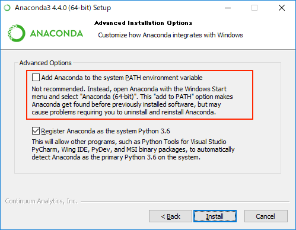

# Python安装
## 在Windows下的安装
### Anaconda安装步骤
* Anaconda的官网地址是：

[https://www.continuum.io/downloads](https://www.continuum.io/downloads)

	* 如果上面的网址访问不了，或速度太慢。可以尝试清华大学的镜像：[https://mirrors.tuna.tsinghua.edu.cn/anaconda/archive/](https://mirrors.tuna.tsinghua.edu.cn/anaconda/archive/)
	* 如果你是64位系统（大多数情况），请下载 [Anaconda3-4.3.1-Windows-x86_64.exe](https://mirrors.tuna.tsinghua.edu.cn/anaconda/archive/Anaconda3-4.3.1-Windows-x86_64.exe)
	* 如果你是32位系统，请下载 [Anaconda3-4.3.1-Windows-x86.exe](https://mirrors.tuna.tsinghua.edu.cn/anaconda/archive/Anaconda3-4.3.1-Windows-x86.exe)
* 如果安装的是Anaconda 4.4.0以前的版本，则安装下载的文件即可
* 如果安装的版本是Anaconda 4.4.0+，则
	* 需要在安装时，选择将Anaconda加入到环境变量PATH中，如下图
	
	

	
	

	
	* 也可以改用Anaconda提供的Anaconda Navigator或Anaconda Command Prompt（在Anaconda的开始菜单下）
	

## 在Mac下的安装
### Anaconda安装步骤
* 下载地址同上
* Mac下有两种方式，一是图形化安装，一种是命令行安装。推荐使用图形化安装：
	* 请下载 [Anaconda2-4.3.1-MacOSX-x86_64.pkg](https://mirrors.tuna.tsinghua.edu.cn/anaconda/archive/Anaconda2-4.3.1-MacOSX-x86_64.pkg)
	* 双击安装即可